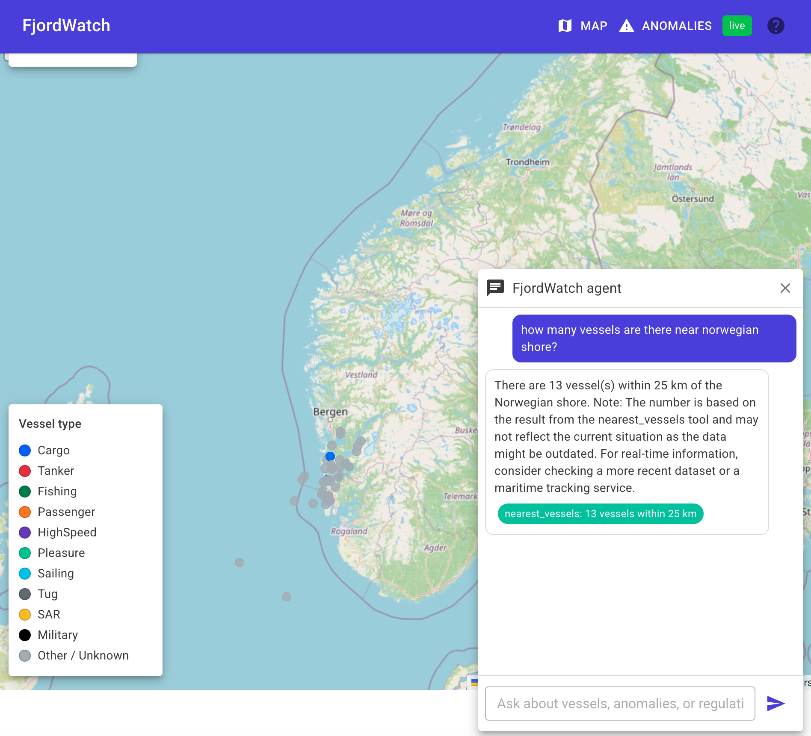
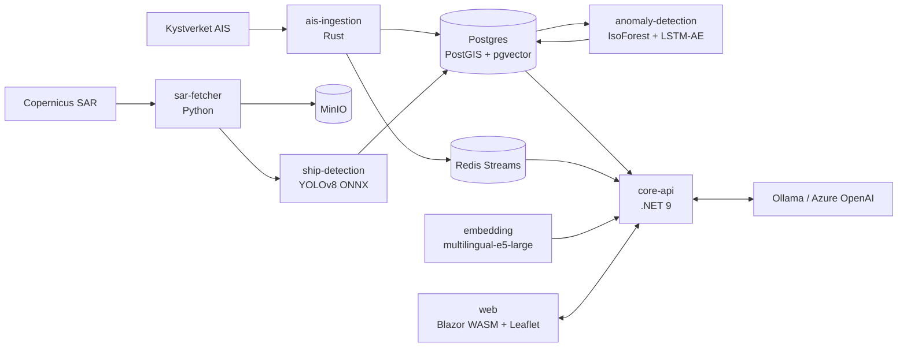

# FjordWatch

**Open-source maritime intelligence platform for the Norwegian coast.**

Live AIS vessel tracking from Kystverket, Sentinel-1 SAR dark-vessel
detection, trajectory anomaly scoring, and a natural-language agent over
the data. Six services, one `make up` away.

> ⚠ Independent portfolio project. Research and learning only. **Not for
> operational surveillance, law enforcement, or any decision affecting a
> specific vessel or operator.** See [DISCLAIMER.md](./DISCLAIMER.md) and
> [docs/dark-vessel-limitations.md](./docs/dark-vessel-limitations.md).

[](https://github.com/ErdemKilci/fjordwatch/actions/workflows/rust.yml)
[](https://github.com/ErdemKilci/fjordwatch/actions/workflows/dotnet.yml)
[](https://github.com/ErdemKilci/fjordwatch/actions/workflows/python.yml)
[](https://github.com/ErdemKilci/fjordwatch/actions/workflows/compose-validate.yml)



## What it does

- **Live map.** Every Norwegian-coast vessel that broadcasts AIS appears on a Leaflet map within seconds of the message hitting the wire. Click a vessel to see its 24-hour track and metadata.
- **Anomaly tab.** A trajectory-anomaly ensemble (Isolation Forest + LSTM autoencoder) runs every 10 minutes and lists vessels whose recent behaviour departs from baseline traffic. Each row links back to the map for replay.
- **Dark vessel overlay.** Sentinel-1 SAR scenes are tiled and run through a YOLOv8 ONNX detector. Detections are correlated against the AIS positions stream; anything without a matching broadcast in a 500 m / 30-minute window is flagged red.
- **Agent.** A bottom-right chat panel calls structured tools over the data (nearest vessels, vessel history, recent anomalies, dark vessels, regulation search). Every fact in an answer cites the tool that produced it. Default LLM is local Ollama; one env var swaps to Azure OpenAI.

## Architecture



Full diagrams (sequence per feature, observability flow, deployment) live in
[docs/architecture.md](./docs/architecture.md).

## Tech stack and rationale

| Layer | Technology | Why |
|---|---|---|
| AIS ingestion | **Rust** + `tokio` + `sqlx` | High-throughput, byte-level NMEA decoding with predictable latency. Tiny container. ([ADR-0007](./docs/adr/0007-rust-for-ais-ingestion.md)) |
| Core API | **.NET 9** ASP.NET Core Minimal API + SignalR + Dapper | Strongest stack for the user-facing surface. Dapper over EF Core for a read-heavy spatial path. ([ADR-0001](./docs/adr/0001-dapper-over-ef-for-readpath.md)) |
| ML services | **Python 3.12** + FastAPI + scikit-learn + PyTorch + ONNX | Native ML ecosystem. CPU-only torch wheels keep images portable. |
| Frontend | **Blazor WebAssembly** + MudBlazor + Leaflet 1.9 + SignalR | Real-time map with viewport-filtered push. |
| Database | **Postgres 16** + PostGIS + pgvector | Spatial queries, time-series, and embeddings in one place. ([ADR-0006](./docs/adr/0006-postgis-over-timescaledb.md)) |
| Streaming | **Redis Streams** | Fan-out from ingestion to consumers, no Kafka complexity. |
| Object storage | **MinIO** (local), Azure Blob (optional cloud) | S3-compatible API, swap via env var. |
| LLM agent | **Custom orchestrator** + Ollama (default) or Azure OpenAI | One-shot tool dispatch with citations first-class. ([ADR-0004](./docs/adr/0004-custom-orchestrator-vs-semantic-kernel.md)) |
| Observability | OpenTelemetry + Prometheus + Grafana + Tempo + Loki | One scrape per service; dashboards as JSON in `infrastructure/observability/grafana/dashboards/`. |
| Orchestration | docker compose (local), Bicep + Azure Container Apps (optional) | Local first, cloud optional. |

## Quickstart

Requirements: Docker and `make`. No Azure account, no Copernicus credentials,
no Ollama download required for first run.

```bash
git clone https://github.com/ErdemKilci/fjordwatch.git
cd fjordwatch
make env             # copy .env.example -> .env
make up              # bring up Postgres, Redis, MinIO, Ollama, db-migrate, all six services
make ps              # verify health

open http://localhost:5000
```

To pull a real Llama model and ingest the regulation corpus:

```bash
docker compose exec ollama ollama pull llama3.1:8b-instruct-q4_K_M
docker compose run --rm embedding \
    python -m embedding.ingest_corpus \
        --database-url "$DATABASE_URL" --embedding-url http://embedding:8004
```

The optional observability stack (Grafana, Tempo, Loki, Prometheus, four
dashboards) starts separately:

```bash
make up-obs
open http://localhost:3000   # Grafana, anonymous-admin
```

A 3-minute walkthrough is in [docs/demo.md](./docs/demo.md).

## Repository layout

```
fjordwatch/
├── services/
│   ├── ais-ingestion/              # Rust + tokio + sqlx
│   ├── core-api/                   # .NET 9 (Domain, Infrastructure, Agent, Api, Tests)
│   ├── anomaly-detection/          # Python FastAPI + sklearn + PyTorch
│   ├── ship-detection/             # Python FastAPI + ONNX runtime
│   ├── sar-fetcher/                # Python + rasterio + boto3
│   ├── embedding/                  # Python FastAPI + sentence-transformers
│   ├── web/                        # Blazor WebAssembly + MudBlazor + Leaflet
│   └── db/migrations/              # Flyway SQL migrations (V1..V4)
├── infrastructure/observability/   # Prometheus, Tempo, Loki, Grafana provisioning + dashboards
├── docs/
│   ├── architecture.md             # full topology + per-feature sequence diagrams
│   ├── data-sources.md             # licensed open data registry
│   ├── dark-vessel-limitations.md  # mandatory reading before reviewing the dark overlay
│   ├── agent-honesty.md            # hallucination guardrails
│   ├── plans/                      # one plan + summary per build phase
│   └── adr/                        # architecture decision records
├── .github/workflows/              # rust, dotnet, python, compose-validate
├── docker-compose.yml              # local stack
├── docker-compose.observability.yml
├── Makefile                        # up/down/test/lint/format/migrate
├── FjordWatch-SPEC.md              # the full project specification
└── DISCLAIMER.md
```

## Data sources

All sources are public and openly licensed; see
[docs/data-sources.md](./docs/data-sources.md). FjordWatch relies on
Kystverket AIS (NLOD 2.0), Copernicus Sentinel-1 (Copernicus open license),
OpenStreetMap + OpenSeaMap tiles (ODbL), and curated regulation excerpts
under their respective open licenses.

> **Note on AIS coverage.** The public Kystverket TCP feed at
> `153.44.253.27:5631` publishes a regional sample. In practice, the
> south-west coast from Stavanger to Bergen. The architecture is
> region-agnostic; pointing `AIS_SOURCE_HOST`/`AIS_SOURCE_PORT` at a full
> national feed (e.g. via [Kystdatahuset](https://kystdatahuset.no))
> immediately lights up Oslofjord and the rest of Norway.

## Documentation

- [Specification](./FjordWatch-SPEC.md): the full project spec, including phase-by-phase build order.
- [Architecture](./docs/architecture.md): topology + per-feature sequence diagrams.
- [ADRs](./docs/adr): seven decisions documented with context, alternatives, and consequences.
- [Phase plans and summaries](./docs/plans): one plan + summary per phase from 0 to 6.
- [Demo script](./docs/demo.md): three-minute walkthrough.
- [Disclaimer](./DISCLAIMER.md): scope, licensing, limits of use.

## Status

Phases 0 to 6 complete. Phase 7 (optional cloud deployment via Bicep +
Azure Container Apps) is an opt-in additive path; FjordWatch is designed
to run end-to-end on a developer laptop with `docker compose`.

## License

[MIT](./LICENSE).
