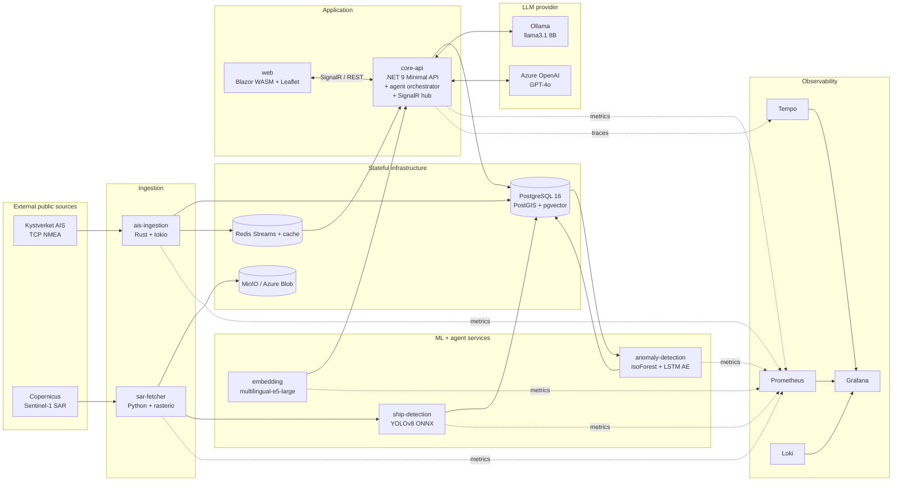
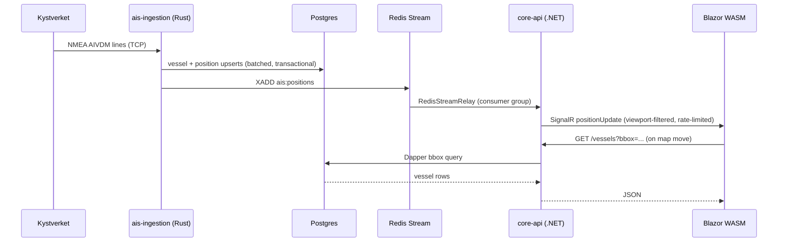
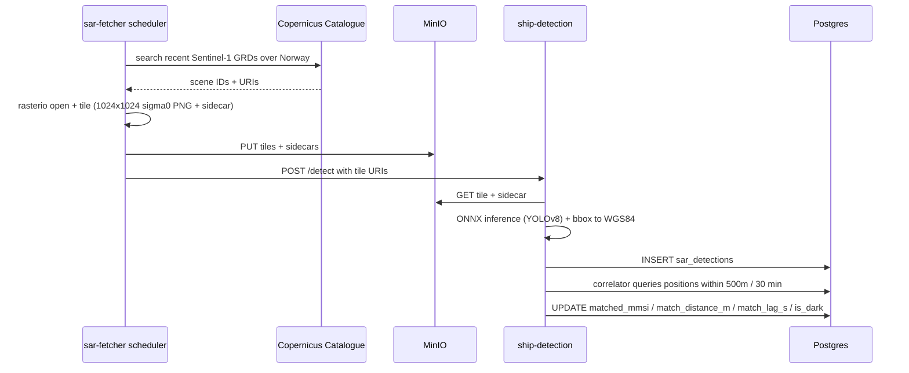
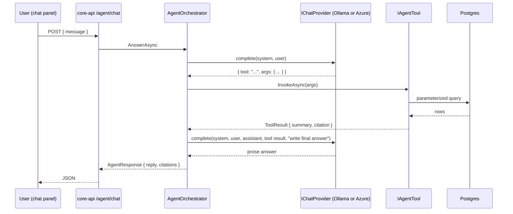

# Architecture

FjordWatch is a six-service maritime intelligence platform for the Norwegian
coast. This document is the entry point for reviewers; it describes the
runtime topology, the data flow per feature, and where each non-trivial
decision is documented.

## Runtime topology



## Data flow per feature

### Live AIS map



### Anomaly detection

```mermaid
sequenceDiagram
    participant sched as anomaly-detection scheduler (every 10 min)
    participant pg as Postgres
    participant ens as Ensemble (IsoForest + LSTM-AE)
    participant api as core-api
    participant web as Blazor WASM
    sched->>pg: SELECT positions WHERE ts > now() - 6h
    pg-->>sched: per-MMSI windows
    sched->>ens: features + sequence
    ens-->>sched: score + iso_score + lstm_score + contributing
    sched->>pg: INSERT vessel_anomalies ... ON CONFLICT DO NOTHING
    web->>api: GET /anomalies?since=&minScore=
    api->>pg: Dapper read
    pg-->>api: rows
    api-->>web: JSON; click → focus map at vessel
```

### Dark vessel detection



### LLM agent



## Component responsibilities

| Component | Language | Responsibility |
|---|---|---|
| `ais-ingestion` | Rust | Pull NMEA AIVDM/AIVDO from Kystverket, decode, upsert vessels and positions, publish to Redis Stream. |
| `core-api` | .NET 9 | REST surface, SignalR hub, agent orchestrator with tools over the data layer. |
| `ship-detection` | Python | YOLOv8 ONNX inference on Sentinel-1 SAR tiles plus AIS correlator. |
| `anomaly-detection` | Python | Trajectory features + Isolation Forest + LSTM autoencoder ensemble. |
| `sar-fetcher` | Python | Scheduled Sentinel-1 fetch + rasterio tiling + MinIO upload. |
| `embedding` | Python | multilingual-e5-large embeddings for the agent's RAG corpus. Stub mode for CI. |
| `web` | Blazor WASM | Real-time map, anomaly tab, dark vessels overlay, agent chat panel. |
| `postgres` | Postgres + PostGIS + pgvector | Spatial vessel and detection storage, regulation embeddings. |
| `redis` | Redis | AIS fan-out (Streams), vessel cache, rate limiting. |
| `minio` | MinIO | SAR tile storage, fixture archive. |
| `ollama` | Ollama | Default local LLM serving. |

## Cross-cutting concerns

- **Configuration:** every variable in `.env.example`. Each service consumes only the variables it needs; defaults are dev-grade.
- **Observability:** Prometheus scrape on `/metrics` of every service. Grafana dashboards in `infrastructure/observability/grafana/dashboards/`. Tempo traces and Loki logs ship via OTLP when `OTEL_EXPORTER_OTLP_ENDPOINT` is set.
- **Health and readiness:** every service exposes `/healthz` (liveness) and `/readyz` (readiness). Compose healthchecks gate dependent services.
- **Security boundaries:** no inbound auth in v1. The agent endpoint applies an in-process rate limit; production deployments behind a reverse proxy add network-level auth.
- **Citations:** every fact returned by the agent carries a Citation pointing back to the tool that produced it; see [`agent-honesty.md`](agent-honesty.md).
- **Limits and disclaimers:** see [`dark-vessel-limitations.md`](dark-vessel-limitations.md) and [`DISCLAIMER.md`](../DISCLAIMER.md).

## Decisions

Non-trivial choices are recorded as ADRs in [`adr/`](./adr/):

| ADR | Decision |
|---|---|
| [0001](./adr/0001-dapper-over-ef-for-readpath.md) | Dapper + Npgsql for the .NET read path, not EF Core. |
| [0002](./adr/0002-isoforest-lstm-ae-ensemble.md) | IsoForest + LSTM autoencoder ensemble for anomaly scoring. |
| [0003](./adr/0003-rasterio-vs-gdal-bindings.md) | rasterio over the GDAL Python bindings. |
| [0004](./adr/0004-custom-orchestrator-vs-semantic-kernel.md) | Custom one-shot orchestrator instead of the SK Ollama connector. |
| [0005](./adr/0005-pgvector-vs-qdrant.md) | pgvector for the RAG corpus, not a separate vector DB. |
| [0006](./adr/0006-postgis-over-timescaledb.md) | PostGIS for spatial + time-series vessel data, not TimescaleDB. |
| [0007](./adr/0007-rust-for-ais-ingestion.md) | Rust for the AIS ingestor, not .NET. |
