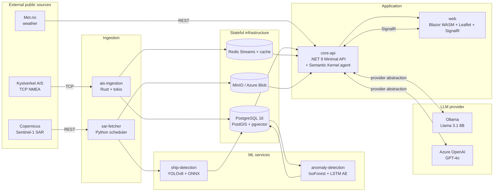

# Architecture

This document is the entry point for understanding how FjordWatch fits together. Phase 0 ships the high-level topology; subsequent phases fill in component-level diagrams (sequence, deployment, data flow) as services come online.

## High-level overview

## Component responsibilities

| Component | Language | Responsibility |
|---|---|---|
| `ais-ingestion` | Rust | Pull NMEA AIVDM/AIVDO from Kystverket, decode, upsert vessels and positions, publish to Redis Stream. |
| `core-api` | .NET 9 | REST surface, SignalR hub, Semantic Kernel agent with tools over the data layer. |
| `ship-detection` | Python | YOLOv8 inference on Sentinel-1 SAR tiles. |
| `anomaly-detection` | Python | Trajectory feature engineering, Isolation Forest + LSTM autoencoder ensemble. |
| `sar-fetcher` | Python | Scheduled fetch of Sentinel-1 GRD scenes, tile, store in object storage. |
| `web` | Blazor WASM | Real-time map, anomaly tab, dark vessels overlay, agent chat panel. |
| `postgres` | Postgres + PostGIS + pgvector | Spatial vessel and detection storage, regulation embeddings. |
| `redis` | Redis | AIS fan-out (Streams), vessel cache, rate limiting. |
| `minio` | MinIO | SAR tile storage, fixture archive. |
| `ollama` | Ollama | Default local LLM serving. |

## Cross-cutting concerns

- **Configuration:** `.env.example` enumerates every variable. Each service consumes only the variables it needs.
- **Observability:** OpenTelemetry traces in every service, scraped by Tempo. Logs ship to Loki via the OTLP exporter or stdout. Metrics scraped by Prometheus. Grafana dashboards in `infrastructure/grafana/`.
- **Health and readiness:** every service exposes `/healthz` (liveness) and `/readyz` (readiness). Compose healthchecks gate dependent services.
- **Security boundaries:** no inbound auth in v1. The single API key on `core-api` write paths is for demonstration only.

## Decisions

Non-trivial choices are recorded as ADRs in [`docs/adr/`](./adr/). The template lives at [`docs/adr/0000-template.md`](./adr/0000-template.md).
